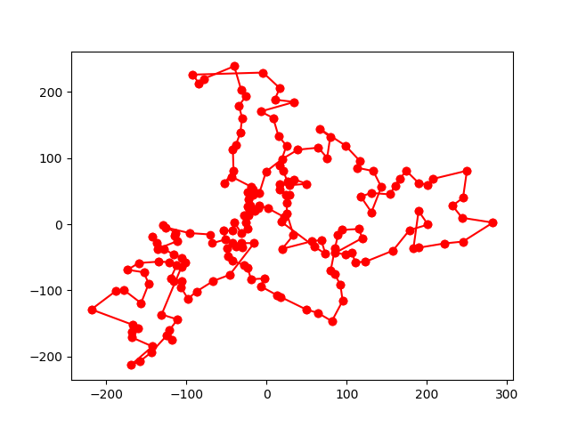
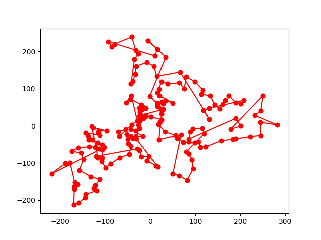

## TSP Approximation algorithms

### Dependencies
networkx, matplotlib (only for visualization)

### Results
The following results are obtained for "traveling around Hokkaido".

- Christofides' algorithm  
 

- Double-Tree algorithm  
 

